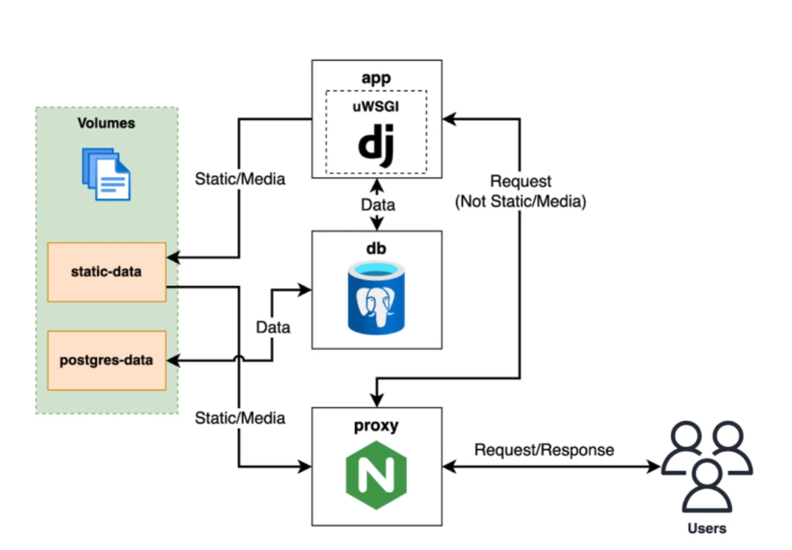

# Advanced_Django_training
Django using a TDD approach, using containerization of it for agility, API documentation with Swagger, Github Actions for automated testing, etc...


# Apps

- ```app/``` - Django project 
- ```app/core/``` - Code shared between multiple apps
- ```app/user/``` - User related code (User registration & auth tokens)
- ```app/recipe/``` - Recipe related code (Handling and updating ingrediants and tags and managing tags)





<code>docker-compose run --rm app sh -c "python manage.py collectstatic"</code> <br>

```run``` will start a specific container defined in config, to remove the container once is finished running. Important to avoir having lots of containers running in the background. <br>
```--rm``` removes the container <br>
```sh -c``` passes in a shell command


## Init project

```docker-compose run --rm app sh -c "django-admin startproject app .```

## Start services

```docker-compose up``` <br>


```docker build .``` once one has the app folder created at root <br>


<br>

**How we'll test** <br>
```docker-compose run --rm app sh -c "python manage.py test"```
<br>


**Django installation from within docker**<br>
```docker-compose run --rm app sh -c "django-admin startproject app ."```
<br>


**Run project with Docker Compose**<br>
```docker-compose up```
<br>


### Other commands:


**Stop all the containers** <br>
```docker stop $(docker ps -a -q)```

<br>

**Remove all the containers**<br>
```docker rm $(docker ps -a -q)```

<br>

**Creating core app**<br>
```docker-compose run --rm app sh -c "python manage.py startapp core"```


# DB Migration:

Init:

```docker-compose run --rm app sh -c "python manage.py makemigrations"```